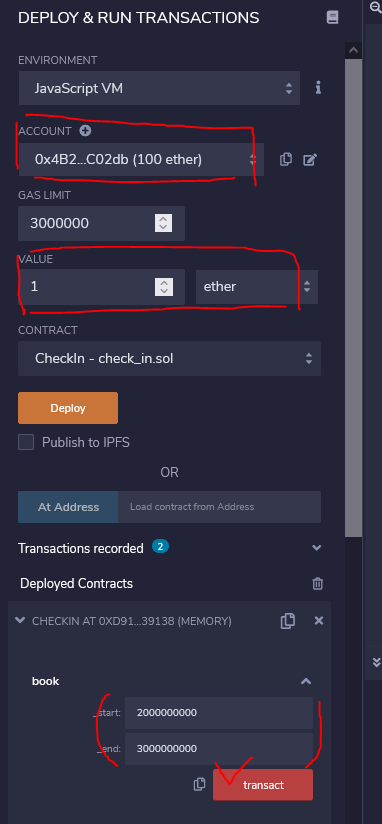
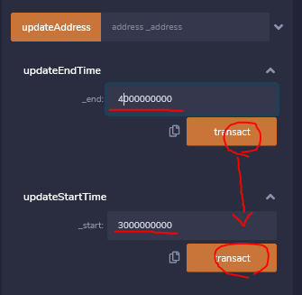
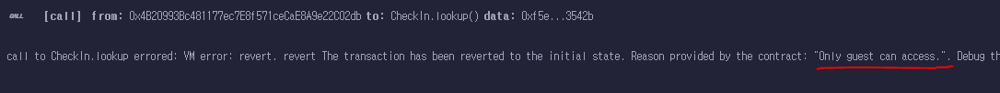
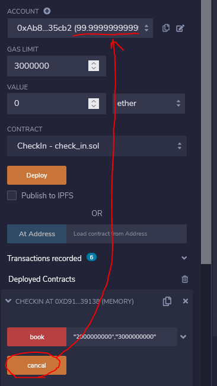
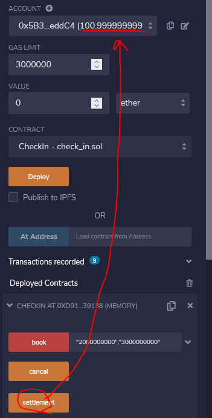

# 블록체인을 이용한 호텔 예약 시스템
컴퓨터공학과 블록체인 과목 조별 프로젝트

---

## 기능
### 예약

스마트 계약 배포 후 `book` 함수를 이용하여 예약할 수 있음. 예약 함수 실행 시 `1 ether` 이상 입금 필수. 시작 시간과 종료 시간은 [유닉스 시간](https://ko.wikipedia.org/wiki/%EC%9C%A0%EB%8B%89%EC%8A%A4_%EC%8B%9C%EA%B0%84)임.

### 예약내용 변경

예약 함수 수행 후 예약 시간을 변경할 수 있음. 예약을 수행했던 계정으로 `updateStartTime`, `updateEndTime` 함수를 사용하여 예약 시간을 변경한다.

### 조회

예약을 수행한 계정으로 `lookup` 함수를 실행해서 시작 시간과 종료 시간을 확인할 수 있음. 예약을 수행한 계정만 확인 가능함.

### 다른 사용자 제한

다른 계정으로는 `lookup`과 같은 함수를 수행할 수 없음.

### 예약 취소

예약을 수행한 계정을 `cancal` 함수를 실행해서 예약을 취소할 수 있음. 함수 실행 후 예약자 계좌에 이더 돌아왔는지 확인.

### 정산

계약을 배포했던 계정으로 `settlement` 함수를 실행하면 예약자가 입금했던 이더가 들어온다.

> 원래는 예약 기간이 종료되어야 실행할 수 있지만 원활한 시연을 위해 해당 코드를 삭제함.

---

## 프로젝트 진행하면서 어려웠던 점

## 프로젝트 진행하면서 아쉬웠던 점
